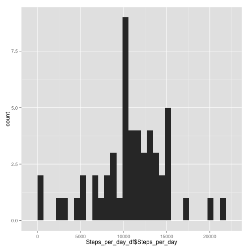
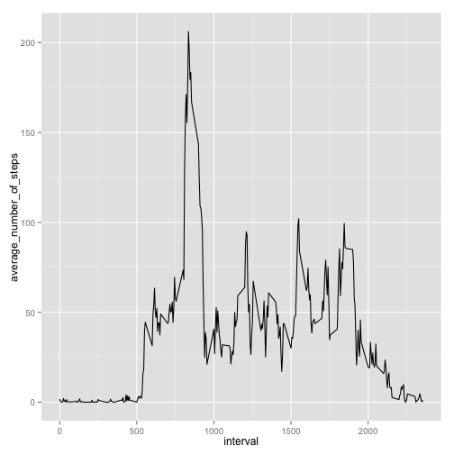
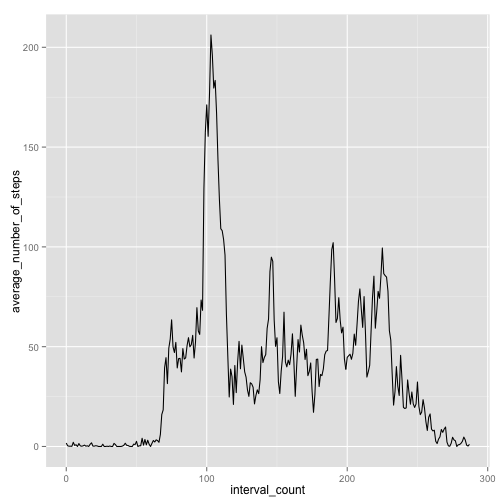
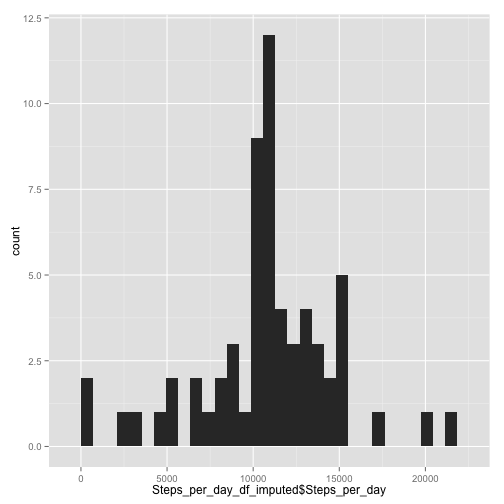
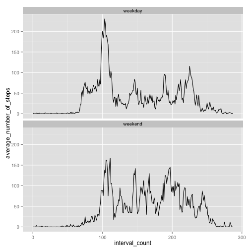

This document contains information regarding the Reproducible Research-Peer Assessment 1.

## Loading and preprocessing the data

```r
##  Load packages
library(dplyr)
library(ggplot2)
##  Read activity.csv file if it exists
if (file.exists("activity.csv")) {
        Activity_df <- read.csv("activity.csv")
        }
##  Convert date column from class factor to class date
Activity_df$date <- as.Date(Activity_df$date)
```

The interval column are labels rather than measures of time on a linear scale
The intervals go from 45, 50, 55, to 100, 105 ...
A new column will be added with a linear scale with 0 corresponding to 0, 1 to 5, 2 to 10, etc.


```r
##  First, create a function to convert interval scale to count scale
interval_to_count <- function(interval_in) {
        count_out <- (interval_in / 5) - floor(interval_in / 100) * 8
}
##  Apply the function to interval vector
counts <- sapply(Activity_df$interval, interval_to_count)
##  Add counts vector of Activity_df
Activity_df <- mutate(Activity_df, interval_count = counts)
```
## What is mean total number of steps taken per day?

### Calculate the total number of steps taken per day.

```r
Steps_per_day <- tapply(Activity_df$steps, Activity_df$date, sum)
##  Convert results into a data frame
Steps_per_day_df <- data.frame(Steps_per_day)
```

### Make a histogram of the total number of steps taken per day

```r
##  Make a histogram of results using ggplot2
qplot(Steps_per_day_df$Steps_per_day, geom="histogram")
```

 

### Calculate and report the mean and median of the total number of steps per day

```r
##  Ignore missing data
mean_steps <- mean(Steps_per_day_df$Steps_per_day, na.rm = TRUE)
median_steps <- median(Steps_per_day_df$Steps_per_day, na.rm = TRUE)
##  Report mean and median values
```
The mean of the total number of steps taken is 1.0766189 &times; 10<sup>4</sup>.
  
The median of the total number of steps taken is 10765.

## What is the average daily activity pattern?
  
### Make a time series plot of the 5-minute interval and the average number of steps taken, averaged across all days


```r
##  Using dplyr package to group number of steps by time interval
Activity_df_grouped <- group_by(Activity_df, interval)
Activity_averages_df <- summarize(Activity_df_grouped, average_number_of_steps = mean(steps, na.rm = TRUE))
##  Make a line plot using qplot within the ggplot2 package
qplot(interval, average_number_of_steps, data = Activity_averages_df, geom = "line")
```

 

This plot is distorted because of the use of the "interval" variable on the x-axis.

Below is a plot using interval_count instead of interval

```r
Activity_df_grouped_count <- group_by(Activity_df, interval_count)
Activity_averages_df_count <- summarize(Activity_df_grouped_count, average_number_of_steps = mean(steps, na.rm = TRUE))
qplot(interval_count, average_number_of_steps, data = Activity_averages_df_count, geom = "line")
```

 

### Which 5-minute interval, on average across all the days in the dataset, contains the maximum number of steps?


```r
##  Find maximum, the index with this value, and then the interval corresponding to that index
max_steps <- max(Activity_averages_df$average_number_of_steps)
index_max <- match(max_steps, Activity_averages_df$average_number_of_steps)
interval_max <- Activity_averages_df$interval[index_max]
```

The interval with the maximum number of steps is 835.

The plots are consistent with interval 0 corresponding to the interval from midnight to 12:05 AM

The maxiumum number of steps then occurs between 8:35 AM and 8:40 AM

## Imputing missing values

### Calculate and report the total number of missing values in the dataset


```r
##  Using the filter function from dplyr to get rows with missing steps values
missing_steps_df <- filter(Activity_df, is.na(steps) == TRUE)
number_missing_values <- nrow(missing_steps_df)
```

The total number of missing values in the dataset is 2304.

### Devise a strategy for filling in all of the missing values in the dataset.

Each missing value will be replaced with the average for that time interval from the entire dataset.
These values were calculated previously.


```r
##  Create a function to find the mean number of steps given the interval
get_mean_number_of_steps <- function(missing_interval) {
       index_mean_number_of_steps <- match(missing_interval, Activity_averages_df$interval)
       mean_number_of_steps <- Activity_averages_df$average_number_of_steps[index_mean_number_of_steps]
}

##  Calculate inputed values using sapply

imputed_values <- sapply(missing_steps_df$interval, get_mean_number_of_steps)
```

### Create a new dataset that is equal to the original dataset but with the missing data filled in


```r
##  Create Activity_df_imputed with missing values replaced

Activity_df_imputed <- Activity_df
Activity_df_imputed[is.na(Activity_df_imputed$steps) == TRUE, ]$steps <- imputed_values
```

### Make a histogram of the total number of steps taken each day

Calculate the total number of steps taken per day using the dataset with imputed data.

```r
Steps_per_day_imputed <- tapply(Activity_df_imputed$steps, Activity_df_imputed$date, sum)
##  Convert results into a data frame
Steps_per_day_df_imputed <- data.frame(Steps_per_day_imputed)
```


```r
##  Make a histogram of results using ggplot2
library(ggplot2)
qplot(Steps_per_day_df_imputed$Steps_per_day, geom="histogram")
```

 

### Calculate and report the mean and median total number of steps taken per day in the dataset with imputed data


```r
mean_steps_imputed <- mean(Steps_per_day_df_imputed$Steps_per_day)
median_steps_imputed <- median(Steps_per_day_df_imputed$Steps_per_day)
##  Report mean and median values
```
The mean of the total number of steps taken is 1.0766189 &times; 10<sup>4</sup> in the dataset with imputed data.
  
The median of the total number of steps taken is 1.0766189 &times; 10<sup>4</sup> in the dataset with imputed data.

### Do these values differ from the estimates from the first part of the assignment?

The difference between the mean values is 0.

The difference between the median values is 1.1886792.

### What is the impact of imputing missing data on the estimates of the total daily number of steps?

The estimates of the total daily number of steps were changed very slightly. The average was unchanged (since the average values are used in the imputation procedure) and the median was changed by 0.0110421 percent.

## Are there differences in activity patterns between weekdays and weekends?

### Create a new factor variable in the dataset with two levels – “weekday” and “weekend” indicating whether a given date is a weekday or weekend day.


```r
##  Create a function that converts a day of the week to "weekday" or "weekend"
weekday_or_weekend <- function(day) {
        weekdays <- c("Monday", "Tuesday", "Wednesday", "Thursday", "Friday")
        day_type <- "weekend"
        if(day %in% weekdays) {
                day_type <- "weekday"
        }
        day_type
}

##  Apply this function to converts days to "weekday" or "weekend"
day_types <- sapply(weekdays(Activity_df$date), weekday_or_weekend)

##  Convert day_types to a factor
day_types <- factor(day_types)

##  Add this column to Activity_df_imputed
Activity_df_weekday_weekend <- mutate(Activity_df_imputed, day_type = day_types)
```

### Make a panel plot containing a time series plot (i.e. type = "l") of the 5-minute interval (x-axis) and the average number of steps taken, averaged across all weekday days or weekend days (y-axis).


```r
##  First calculate the number of steps averaged over weekdays or weekend days
##  It is likely that there is a better way to do this, but this works
Activity_df_weekday <- filter(Activity_df_weekday_weekend, day_type == "weekday")
Activity_df_weekday_grouped <- group_by(Activity_df_weekday, interval)
Activity_df_weekday_averages <- summarize(Activity_df_weekday_grouped, average_number_of_steps = mean(steps))
Activity_df_weekday_averages <- mutate(Activity_df_weekday_averages, day_type = "weekday")
Activity_df_weekend <- filter(Activity_df_weekday_weekend, day_type == "weekend")
Activity_df_weekend_grouped <- group_by(Activity_df_weekend, interval)
Activity_df_weekend_averages <- summarize(Activity_df_weekend_grouped, average_number_of_steps = mean(steps))
Activity_df_weekend_averages <- mutate(Activity_df_weekend_averages, day_type = "weekend")
Activity_df_averages <- rbind(Activity_df_weekday_averages, Activity_df_weekend_averages)
Activity_df_averages$day_type <- factor(Activity_df_averages$day_type)
str(head(Activity_df_averages))
```

```
## Classes 'tbl_df' and 'data.frame':	6 obs. of  3 variables:
##  $ interval               : int  0 5 10 15 20 25
##  $ average_number_of_steps: num  2.251 0.445 0.173 0.198 0.099 ...
##  $ day_type               : Factor w/ 2 levels "weekday","weekend": 1 1 1 1 1 1
```

```r
##  Plot two panel plot separated into weekdays and weekends

ggplot(Activity_df_averages, aes(interval, average_number_of_steps)) + geom_line(color = "black") + facet_wrap(~day_type, nrow = 2)
```

 

These plots are distorted by the interval variable.  Replot using the interval_count variable.


```r
Activity_df_weekday_grouped_count <- group_by(Activity_df_weekday, interval_count)
Activity_df_weekday_averages_count <- summarize(Activity_df_weekday_grouped_count, average_number_of_steps = mean(steps))
Activity_df_weekday_averages_count <- mutate(Activity_df_weekday_averages_count, day_type = "weekday")
Activity_df_weekend_grouped_count <- group_by(Activity_df_weekend, interval_count)
Activity_df_weekend_averages_count <- summarize(Activity_df_weekend_grouped_count, average_number_of_steps = mean(steps))
Activity_df_weekend_averages_count <- mutate(Activity_df_weekend_averages_count, day_type = "weekend")
Activity_df_averages_count <- rbind(Activity_df_weekday_averages_count, Activity_df_weekend_averages_count)
Activity_df_averages_count$day_type <- factor(Activity_df_averages_count$day_type)

ggplot(Activity_df_averages_count, aes(interval_count, average_number_of_steps)) + geom_line(color = "black") + facet_wrap(~day_type, nrow = 2)
```

 

#Summary of Observations

The average number of steps per day is approximately 10000 with two days at or near 20000.

On average, activity begins around 6 AM with a peak at 8:35 AM.  Activity trails off starting near 7 PM.

On average, there is more activity on weekdays than on weekends.

On average, activity begins later on weekends and extends later.


